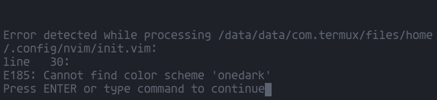

## Setup Termux For Proggramming on Android

 Di sini saya akan menyulap aplikasi termux agar menjadi tools yang canggih sebagai alat untuk programmer di Android.
 
 Berikut contoh hasil setup yang akan kita lakukan :
 
 ### Get started
 
 Ini adalah tampilan awal termux kita :
 
 
 
 Langkah pertama yang harus kamu lakukan adalah mengupdate dan mengupgrade termux kamu untuk memastikan semua package termux kamu dalam versi terbaru.
 
 gunakan perintah berikut untuk melakukannya
 
 ```
 pkg update && pkg upgrade -y
 ```
 
 Jika sudah selesai langkah kita perlu menginstall beberapa package yang kita butuhkan untuk menyempurnakan setup termux kita.
 
 lakukan perintah berikut untuk memasang beberapa package yang kita butuhkan
 
 ```
 pkg install nodejs git exa -y
 ```

### Styling Termux

Selanjutnya kita akan menghias tampilan termux kita agar terlihat lebih menarik. Pertama kita akan mengubah dulu colorscheme termux kita dengan tema yang kita mau, misalnya disini kita akan menggunakan colorscheme onedark.

langkah-langkah :

#### Ubah Color Scheme

- masuk ke folder `~/.termux` 
   
   ```
   cd ~/.termux/
   ```
- buat file `colors.properties`

   ```
   nano colors.properties
   ```
- Lalu tempel script berikut
   
   ```
   color0=#000000
   color1=#E06C75
   color2=#98C379
   color3=#D19A66
   color4=#61AFEF
   color5=#C678DD
   color6=#56B6C2
   color7=#ABB2BF
   color8=#5C6370
   color9=#E06C75
   color10=#98C379
   color11=#D19A66
   color12=#61AFEF
   color13=#C678DD
   color14=#56B6C2
   color15=#FFFEFE
   background=#1E2127
   foreground=#5C6370
   cursor=#5C6370
   ```
- save dengan tekan tombol  `CTRL + s` lalu keluar dari editor nano dengan `CTRL + x`
- lalu ketikan

  ```
  termux-reload-settings
  ```
  
  maka tampilan termux kamu sudah berubah warna nya menjadi lebih enak di pandang
  
  
 
#### Setting Extrakeys

Masih dalam folder `.termux` kita edit file `termux.properties` nya

-  Edit file nya dengan perintah nano

   ```
   nano termux.properties
   ```
- Scroll ke bawah cari tulisan seperti gambar di bawah

   

- Lalu salin script di bawah ini dan tempel di bawah tulisan tadi
   
   ```
   extra-keys = [['ESC','/','-','HOME','UP','END','PGUP','KEYBOARD'], \
               ['TAB','CTRL','ALT','LEFT','DOWN','RIGHT','PGDN','SHIFT']]
   ```
- hasilnya seperti ini
   
   
   
- Lalu ketikan

   ```
   termux-reload-settings
   ```
- Maka tampilan keys kamu sekarang berubah seperti ini
   
   


### Ubah font bawaan dengan nerdfont

Kita akan ubah font bawaan termux menjadi font nerdfont. kenapa nerdfont? karena nerdfont support untuk membaca beberapa simbol" yang nantinya akan kita gunakan.

- Pertama download font [disini](https://drive.google.com/file/d/16mZxGH3MX4Xqjan9X5tBWCPHQb7tELzx/view)

- Lalu ketikan perintah 
   
   ```
   termux-setup-storage
   ```
   
   lalu izinkan penyimpanan file
   
- Lalu cari file hasil download tadi di folder download dengan 
   
   ```
   cd /sdcard/Download/
   ```
   
   pindahkan file tadi ke folder `~/.termux` pastikan nama file nya font.ttf
   
   ```
   cp font.ttf ~/.termux
   ```
   
- Lalu ketik
   
   ```
   termux-reload-settings
   ```
-  maka tampilan font akan berubah seperti ini 
   
   
   
#### Hapus Banner Motd

Selanjutnya kita akan hapus banner bawaan aplikasi termux, banner motd adalah banner yang muncul saat pertama kali kita membuka termux. berikut contohnya :


- Pastikan kamu berada di folder utama , ketik
   
   ```
   cd ~
   ```
- Lalu cari letak file banner motd yang terletak di ` ../usr/etc/ ` ketikan :

  ```
  cd ../usr/etc/
  ```
- lalu hapus file motd yang berada di dalam folder tersebut dengan perintah :
   
   ```
   rm motd*
   ```
- kita cek apakah motd sudah berhasil terhapus dengan perintah

   ```
   exit
   ```
- lalu masuk lagi ke apk termux kalian maka banner motd sudah terhapus
   
   
  

### Install Fish Shell

Shell adalah processor makro atau penerjemah command language yang menerjemahkan perintah, yang ditulis oleh pengguna di terminal, ke dalam tindakan sistem yang dijalankan, yang juga dapat secara otomatis dijalankan dalam program yang disebut Shell Scripting. Shell sudah lebih dulu ada sebelum mouse diciptakan, karena ini adalah satu-satunya cara untuk berinteraksi dengan komputer pada saat dulu.

Secara default Shell yang terinstall di apk termux adalah Shell [Bash](https://id.m.wikipedia.org/wiki/Bash), kita akan menginstall kan Shell [Fish](https://fishshell.com/) pada termux kita agar lebih canggih.

Langkah-langkah :
- Pertama kira install Shell Fish pada termux dengan perintah
   
   
   ```
   pkg install fish -y
   ```
- Lalu jadikan fish shell sebagai shell default termux dengan perintah
   
   ```
   chsh -s fish 
   ```
- Lalu keluar dari terminal dengan perintah
   
   ```
   exit
   ```
- Lalu buka lagi apk termux maka sekarang shell default termux kamu adalah fish

  


#### Config Fish Shell

Selanjutnya kita konfigurasi Fish Shell kita agar lebih canggih, sebelumnya coba kita liat apa yang kurang dari Fish Shell kita lakukan perintah berikut :

```
touch index.html index.js index.css
```

lalu ketik :

```
ls
```

ini yang akan kamu lihat :


Seperti ada yang kurang kita lakukan konfigurasi dulu nanti kamu akan melihat perubahannya.

- Pertama masuk ke folder dimana tempat file konfigurasi fish disimpan, ketik perintah berikut :
   
   ```
   cd ~/.config/fish
   ```
- lalu edit file `config.fish` dengan perintah berikut :
   
   ```
   nano config.fish
   ```
- Lalu tempel kan script tersebut di paling bawah :
   
   ```
   alias ls="exa --icons"
   alias la="exa --icons -lgha --group-directories-first"
   alias lt="exa --icons --tree"
   alias lta="exa --icons --tree -lgha"
   export PATH="$PREFIX/bin:$HOME/.local/bin:$PATH"
   ```
   
   seperti ini :
   
   
   
   lalu simpan dengan `CTRL + s` dan kembali dengan `CTRL + x`
   
- Lalu kembali ke direktory home dengan peintah

  ```
  cd ~/
  ```
-  Lalu ketikan
   
   ```
   ls
   ```
   
   ```
   lt
   ```
- Dapat dilihat perubahannya di samping nama file/folder sekarang ada icon kecil yang menggambarkan type file/folder :
   
   
  
#### Install oh my fish

Lalu selanjutnya kita akan install oh my fish agar fish shell kita lebih canggih lagi bisa di pasang theme.

- Pertama salin ke termux lalu enter
   
   ```
   curl -L https://get.oh-my.fish > install
   fish install --path=~/.local/share/omf --config=~/.config/omf 
   ```
   
   Jika done tampilan akan berubah
   
   
   
- Lalu  selanjutnya kita pasang kan tema ke fish shell kita dengan oh my fish, misalnya saya install tema agnoster :
   
   ```
   omf install agnoster
   ```
   
   tema akan otomatis terpasang
   
   

### Install Neovim/Nvim

Neovim adalah salah satu text editor yang paling populer karena mereka adalah alat multiguna dan dapat berinteraksi dengan sistem menggunakan berbagai kait dan fungsi. Cara installnya sebagai berikut :

- Pertama install neovim dengan perintah :
   
   ```
   pkg install neovim -y
   ```
   
#### configurasi nvim

- Buat file configurasinya :
   
   ```
   cd ~/.config
   ```
   
   ```
   mkdir nvim
   ```
   
   ```
   cd nvim
   ```
   
   ```
   nano init.vim
   ```
- Lalu isi dengan script berikut :
   
   ```
   set nocompatible
   set wrap
   set autoindent
   set cursorline
   set encoding=utf-8
   set number
   set laststatus=2
   set shiftwidth=2
   set nocompatible
   
   "keybinding
   nnoremap <C-s> :w<CR>
   nnoremap <C-q> :q<CR>
   nnoremap <C-Q> :q!<CR>
   nnoremap <C-j> :m .+1<CR>
   nnoremap <C-k> :m .-2<CR>
   vnoremap <C-k> :m '<-2<CR>gv=gv
   vnoremap <C-j> :m '>+1<CR>gv=gv
   ```
   
   
   
   save dengan `CTRL + s` keluar `CTRL + x`
   
   
 #### Install VimPlug


- pertama salin ini di terminal kamu lalu enter
   
   ```
   sh -c 'curl -fLo "${XDG_DATA_HOME:-$HOME/.local/share}"/nvim/site/autoload/plug.vim --create-dirs \
       https://raw.githubusercontent.com/junegunn/vim-plug/master/plug.vim'
   ```
- Lalu edit file init.vim  lagi 
   
   ```
   cd ~/.config/nvim
   ```
   
   ```
   nano init.vim
   ```
- Salin script di bawah ini di posisi paling bawah
   
   ```
   "VimPlug
   call plug#begin('~/.PlugVim')
   Plug 'navarasu/onedark.nvim'
   Plug 'mattn/emmet-vim'
   Plug 'itchyny/lightline.vim'
   Plug 'psliwka/vim-smoothie'
   call plug#end()
   
   colorscheme onedark
   ```
   
   
   
   lalu simpan dan keluar dari nano
   
-  lalu ketikan nvim di terminal :
   
   ```
   nvim
   ```
   
   
   
   Jika ada yang seperti di atas enter saja
   
- Setelah masuk ke tampilan text editor ketik
  
  ```
  :PlugInstall
  ```
  
  lalu enter seperti gambar di bawah
  
  
  
- Tunggu proses nya sama selesai seperti ini
  
  
  
- Lalu keluar dari nvim dengan `CTRL + q` 
- Setelah itu ke direktory home :
  
  ```
  cd ~/
  ```
- ketikan `nvim index.html`
   
   

Sekarang tampilan text editor nvim kalian sudah keren, semangat coding :)
